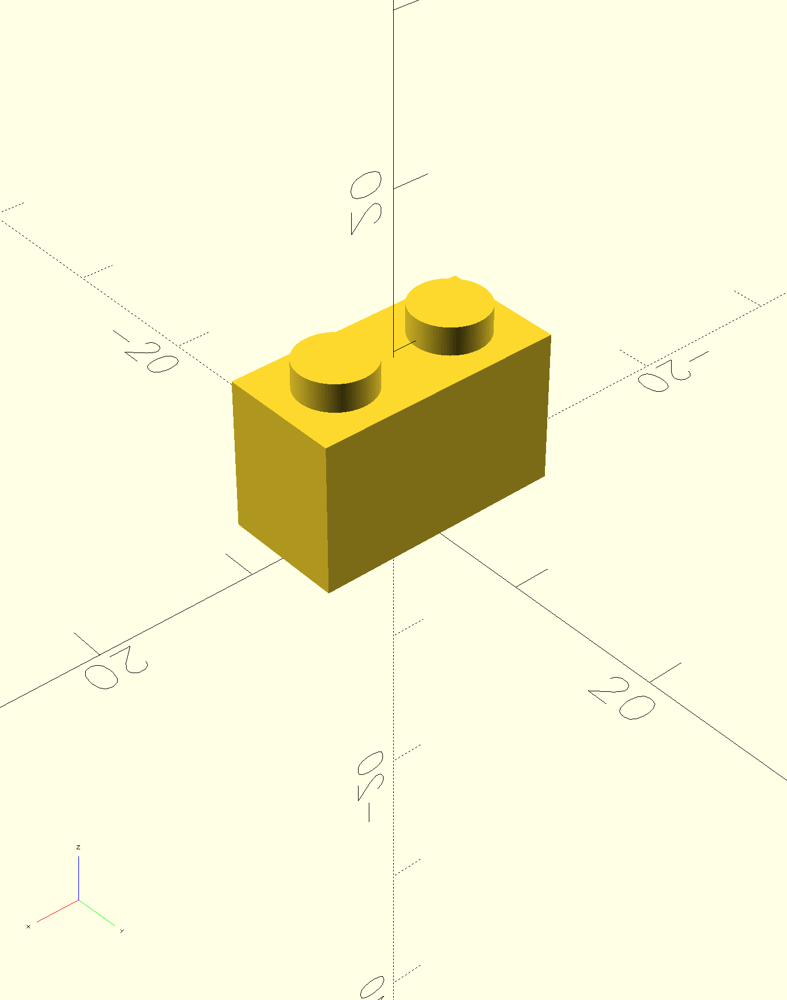
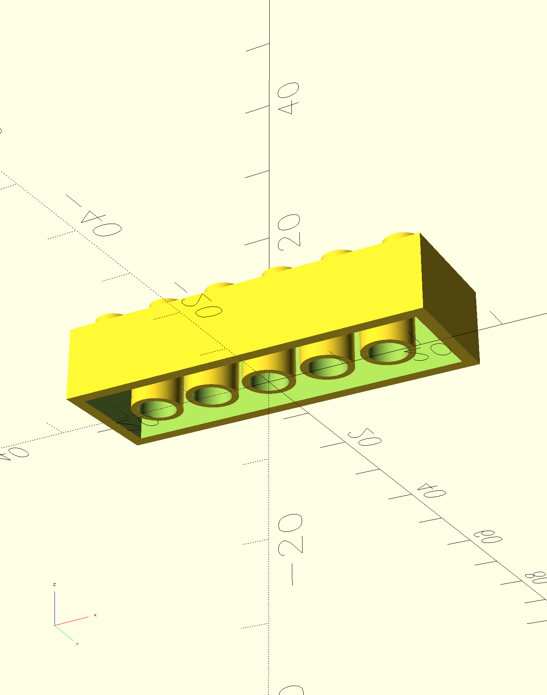
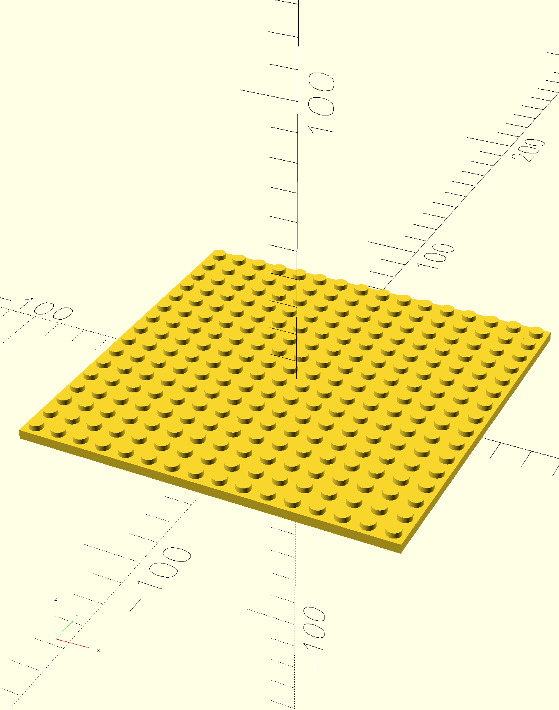
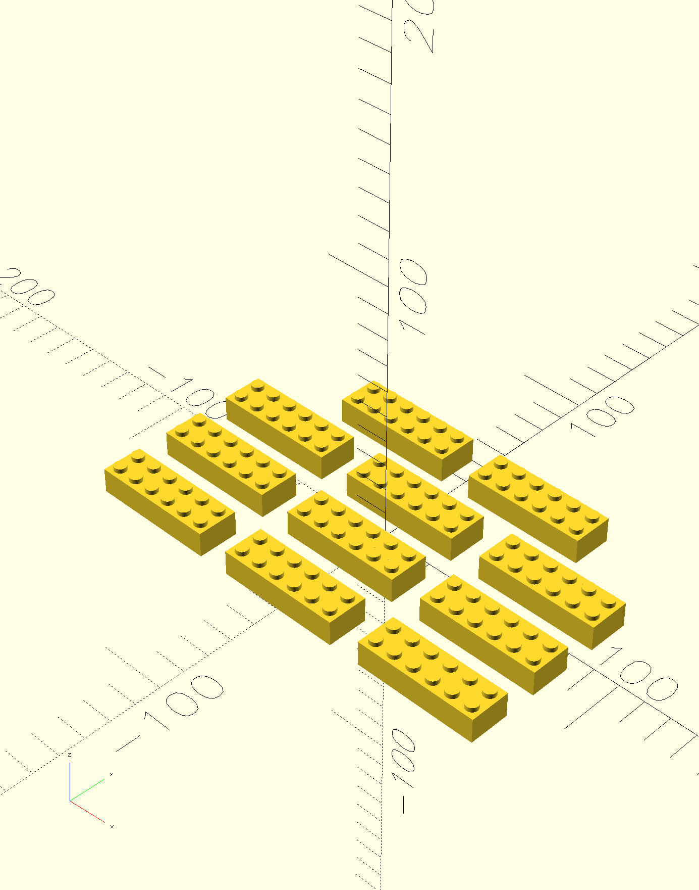
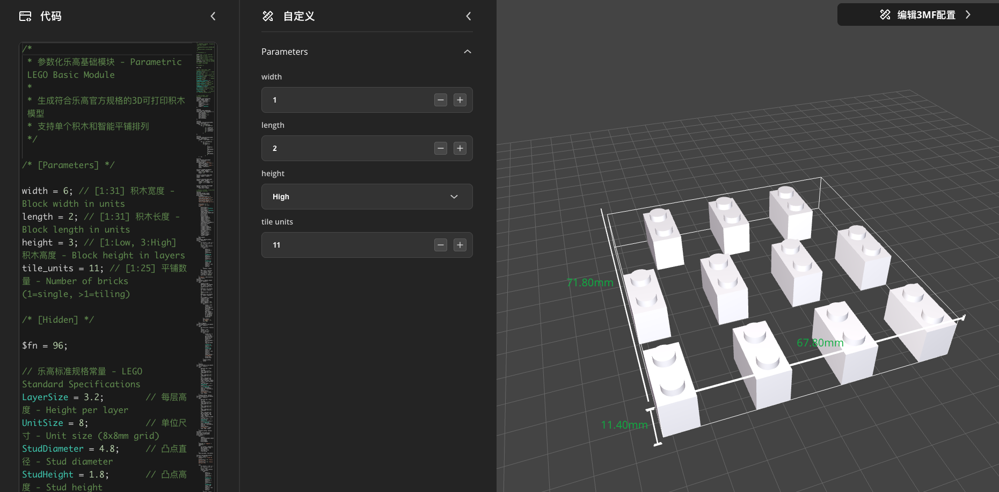

# 参数化乐高基础模块 / Parametric LEGO Basic Module

一个使用OpenSCAD创建的参数化乐高兼容积木3D模型，支持自定义尺寸并针对3D打印进行了优化。现在支持智能平铺功能，可批量生产多个积木！

A parametric LEGO-compatible brick 3D model created with OpenSCAD, supporting custom dimensions and optimized for 3D printing. Now supports intelligent tiling functionality for batch production of multiple bricks!

## 🎯 特性 / Features

### 核心功能 Core Features
- **完全兼容** - 与真实乐高积木100%兼容 / **Fully Compatible** - 100% compatible with real LEGO bricks
- **参数化设计** - 轻松调整长度、宽度、高度 / **Parametric Design** - Easily adjust length, width, height
- **MakerWorld支持** - 完全兼容拓竹MakerWorld参数化界面 / **MakerWorld Compatible** - Fully compatible with Bambu Lab MakerWorld parametric interface
- **3D打印优化** - 考虑了打印精度和结构强度 / **3D Print Optimized** - Considers printing precision and structural strength
- **标准规格** - 严格遵循乐高官方尺寸标准 / **Standard Specifications** - Strictly follows official LEGO dimensions
- **开源免费** - MIT许可证，自由使用和修改 / **Open Source** - MIT license, free to use and modify

### 🆕 平铺功能 Tiling Features
- **智能排列** - 自动计算最优X×Y排列方式 / **Intelligent Arrangement** - Automatically calculate optimal X×Y layout
- **批量生产** - 一次生成1-25个积木 / **Batch Production** - Generate 1-25 bricks at once
- **中心对称** - 以原点为中心的美观布局 / **Center Symmetric** - Aesthetically pleasing layout centered at origin
- **固定间距** - 12mm间距确保打印质量 / **Fixed Spacing** - 12mm spacing ensures print quality
- **尺寸验证** - 智能检查打印床兼容性 / **Size Validation** - Intelligent print bed compatibility checking
- **性能优化** - 针对大批量渲染优化 / **Performance Optimized** - Optimized for large batch rendering

## 📸 示例渲染 / Sample Renders

以下是不同配置的积木渲染效果：

Here are renders of different brick configurations:

### 2x1 基础积木 / 2x1 Basic Brick


### 6x2 标准积木 / 6x2 Standard Brick


### 6x2 底部视图 / 6x2 Bottom View


### 16x16 大型底板 / 16x16 Large Baseplate


### 🆕 6x2 智能平铺 (11个单位) / 6x2 Intelligent Tiling (11 Units)


### 🎛️ MakerWorld 参数化支持 / MakerWorld Parametric Support


完全支持拓竹MakerWorld参数化模型功能，用户可以通过直观的界面调整所有参数。

Full support for Bambu Lab MakerWorld parametric model functionality, allowing users to adjust all parameters through an intuitive interface.

## 🚀 快速开始 / Quick Start

### 1. 下载和打开 / Download and Open

```bash
git clone https://github.com/tomcatzh/StandardLEGOBlock.git
cd StandardLEGOBlock
```

用OpenSCAD打开 `lego_basic_module.scad` 文件。

Open `lego_basic_module.scad` file with OpenSCAD.

### 2. 自定义参数 / Customize Parameters

在文件顶部修改这些参数：

Modify these parameters at the top of the file:

```scad
// 积木宽度（单位数量）- Block width in units
width = 6; // [1:31]

// 积木长度（单位数量）- Block length in units  
length = 2; // [1:31]

// 积木高度（层数）- Block height in layers
height = 3; // [1:Low, 3:High]

// 🆕 平铺积木数量 - Number of bricks in tiling arrangement
// 设置为1时生成单个积木，大于1时生成平铺排列
// Set to 1 for single brick, >1 for tiling arrangement
tile_units = 1; // [1:25]
```

#### 平铺功能说明 Tiling Function Description

`tile_units` 参数控制生成的积木数量和排列方式：

The `tile_units` parameter controls the number of bricks generated and their arrangement:

- **tile_units = 1**: 生成单个积木（默认模式）/ Generate single brick (default mode)
- **tile_units = 4**: 生成4个积木，系统自动选择最优排列（如2×2）/ Generate 4 bricks, system automatically selects optimal arrangement (like 2×2)
- **tile_units = 9**: 生成9个积木，通常排列为3×3 / Generate 9 bricks, typically arranged as 3×3
- **tile_units = 25**: 生成25个积木，排列为5×5（最大支持）/ Generate 25 bricks, arranged as 5×5 (maximum supported)

### 3. 预览和渲染 / Preview and Render

- 按 `F5` 预览模型 / Press `F5` to preview
- 按 `F6` 完整渲染 / Press `F6` for full render
- 导出STL文件用于3D打印 / Export STL for 3D printing

## 📐 技术规格 / Technical Specifications

### 乐高标准尺寸 / LEGO Standard Dimensions

| 参数 Parameter | 值 Value | 说明 Description |
|---|---|---|
| LayerSize | 3.2mm | 每层高度 / Height per layer |
| UnitSize | 8mm | 单位尺寸 / Unit size |
| StudDiameter | 4.8mm | 凸点直径 / Stud diameter |
| StudHeight | 1.8mm | 凸点高度 / Stud height |

### 3D打印优化 / 3D Printing Optimization

| 参数 Parameter | 值 Value | 说明 Description |
|---|---|---|
| CLEARANCESize | 0.2mm | 配合间隙 / Fitting clearance |
| WallThickness | 1.6mm | 壁厚 / Wall thickness |
| TubeInnerDiameter | 4.8mm | 内管直径 / Inner tube diameter |
| TubeOuterDiameter | 6.5mm | 外管直径 / Outer tube diameter |

## 🧮 智能平铺算法 / Intelligent Tiling Algorithm

### 算法原理 Algorithm Principle

系统使用智能算法自动计算最优的积木排列方式：

The system uses intelligent algorithms to automatically calculate optimal brick arrangements:

1. **因数分解 Factor Decomposition**: 找出tile_units的所有可能因数对 / Find all possible factor pairs of tile_units
2. **尺寸计算 Size Calculation**: 考虑积木实际尺寸和12mm间距 / Consider actual brick size and 12mm spacing  
3. **比例优化 Ratio Optimization**: 选择长宽比最接近1的排列 / Select arrangement with aspect ratio closest to 1

### 计算示例 Calculation Example

以16×2积木4个单位为例 Example with 4 units of 16×2 bricks:

| 排列 Arrangement | 总尺寸 Total Size | 长宽比 Ratio | 选择 Choice |
|---|---|---|---|
| 4×1 | 548×16mm | 34.25 | ❌ 太长 Too long |
| 2×2 | 268×44mm | 6.09 | ⚠️ 较好 Better |
| 1×4 | 128×100mm | 1.28 | ✅ 最优 Optimal |

算法选择1×4排列，因为长宽比最接近正方形，打印床利用率最高。

Algorithm selects 1×4 arrangement because the aspect ratio is closest to square, maximizing print bed utilization.


## 📁 项目结构 / Project Structure

```
StandardLEGOBlock/
├── README.md                           # 项目说明（含平铺功能）/ Project documentation (with tiling)
├── LICENSE                            # MIT许可证 / MIT license
├── lego_basic_module.scad            # 主要OpenSCAD文件（v2.0支持平铺）/ Main OpenSCAD file (v2.0 with tiling)
├── samples/                          # 示例渲染图片 / Sample render images
│   ├── lego_basic_module_2x1.png    # 2x1积木渲染 / 2x1 brick render
│   ├── lego_basic_module_6x2.png    # 6x2积木渲染 / 6x2 brick render
│   ├── lego_basic_module_6x2_bottom.png # 6x2底部视图 / 6x2 bottom view
│   ├── lego_basic_module_6x2_tiling_11.png # 6x2平铺示例 / 6x2 tiling example
│   ├── lego_basic_module_16x16.png  # 16x16底板渲染 / 16x16 baseplate render
│   └── maker_worlds_parametrics.png # MakerWorld参数化界面 / MakerWorld parametric interface
└── .kiro/                           # Kiro AI助手配置 / Kiro AI assistant config
    ├── steering/                    # AI指导文档 / AI guidance documents
    │   ├── product.md              # 产品概述 / Product overview
    │   ├── tech.md                 # 技术栈说明 / Technology stack
    │   └── structure.md            # 项目结构 / Project structure
    └── specs/lego-tiling-generator/ # 平铺功能规格文档 / Tiling feature specifications
        ├── requirements.md         # 需求文档 / Requirements document
        ├── design.md              # 设计文档 / Design document
        └── tasks.md               # 任务列表 / Task list
```

## 🔧 自定义和扩展 / Customization and Extension

### 常见尺寸示例 / Common Size Examples

#### 单个积木示例 Single Brick Examples

```scad
// 2x4 标准积木 / 2x4 standard brick
width = 4; length = 2; height = 3; tile_units = 1;

// 2x2 方形积木 / 2x2 square brick  
width = 2; length = 2; height = 3; tile_units = 1;

// 1x8 长条积木 / 1x8 long brick
width = 8; length = 1; height = 3; tile_units = 1;

// 2x4 薄片 / 2x4 plate
width = 4; length = 2; height = 1; tile_units = 1;
```

#### 🆕 平铺配置示例 Tiling Configuration Examples

```scad
// 完美正方形平铺 - Perfect square tiling
width = 2; length = 2; height = 3; tile_units = 9;
// 结果：3×3排列，总尺寸68×68mm
// Result: 3×3 arrangement, total size 68×68mm

// 智能矩形优化 - Intelligent rectangle optimization
width = 16; length = 2; height = 3; tile_units = 4;
// 结果：1×4排列（而不是4×1），总尺寸128×100mm，长宽比1.28
// Result: 1×4 arrangement (instead of 4×1), total size 128×100mm, ratio 1.28

// 大批量生产 - Large batch production
width = 2; length = 2; height = 3; tile_units = 25;
// 结果：5×5排列，总尺寸128×128mm，标准打印床兼容
// Result: 5×5 arrangement, total size 128×128mm, standard bed compatible

// 优化示例 - Optimization example
width = 6; length = 2; height = 3; tile_units = 6;
// 结果：3×2排列（而不是6×1），更好的打印床利用率
// Result: 3×2 arrangement (instead of 6×1), better bed utilization

// 🆕 质数优化示例 - Prime number optimization example
width = 6; length = 2; height = 3; tile_units = 11;
// 结果：智能[4,4,3]行排列，而不是1×11线性排列
// 总尺寸：196×100mm，长宽比1.96（优于11×1的长宽比11.0）
// Result: Intelligent [4,4,3] row arrangement instead of 1×11 linear
// Total size: 196×100mm, ratio 1.96 (better than 11×1 ratio of 11.0)
```

## 📄 许可证 / License

本项目采用MIT许可证 - 查看 [LICENSE](LICENSE) 文件了解详情。

This project is licensed under the MIT License - see the [LICENSE](LICENSE) file for details.

## 🙏 致谢 / Acknowledgments

- 感谢乐高集团创造了这个令人惊叹的积木系统 / Thanks to The LEGO Group for creating this amazing building system
- 感谢OpenSCAD社区提供的优秀工具 / Thanks to the OpenSCAD community for the excellent tools
- 感谢所有3D打印爱好者的贡献和反馈 / Thanks to all 3D printing enthusiasts for contributions and feedback

## 📞 联系 / Contact

如果你有任何问题或建议，请通过以下方式联系：

If you have any questions or suggestions, please contact via:

- 提交GitHub Issue / Submit a GitHub Issue
- 发送邮件至 / Send email to: i@zxf.io

---

**免责声明 / Disclaimer**: 本项目与乐高集团无关。LEGO®是乐高集团的注册商标。

**Disclaimer**: This project is not affiliated with The LEGO Group. LEGO® is a registered trademark of The LEGO Group.